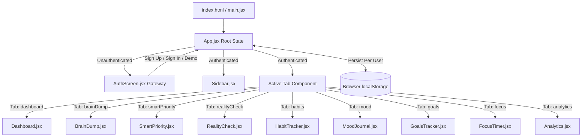

# 🌟 LifeLens — Personal Productivity & Workload Reality HQ


**LifeLens** is an aesthetic, human-centered personal productivity dashboard designed for busy students, researchers, developers, and professionals. It combines rapid thought organizing (**Brain Dump**), multi-factor task prioritization (**Smart Priority**), capacity-based overload detection (**Workload Reality Check**), habit tracking, mood & energy logging, project milestone management, and Pomodoro focus sprints into a unified pastel workspace.

---

## 📌 Problem Statement & Objectives

### The Problem
Modern students and professionals often face:
- **Overloaded Schedules & Burnout:** Estimating task hours without accounting for fluctuating energy levels leads to unrealistic daily plans and exhaustion.
- **Thought Fragmentation:** Messy notes, exam dates, and assignment deadlines scattered across multiple apps cause decision paralysis.
- **Rigid Pre-Selected Software:** Generic task trackers enforce hardcoded categories and mandatory templates that don't fit individual routines.

### The LifeLens Solution
LifeLens provides:
- **Intelligent Workload Reality Check:** Uses energy-efficiency factors to model actual available capacity against task demands before overcommitment happens.
- **1-Click Thought Structuring:** Converts unorganized text lines or voice dictation into structured tasks with deadlines and priority tags.
- **Zero Pre-Selected Assumptions:** Onboarding and settings let users pick their own focus areas, enroll in optional routines, or skip setup entirely to start with a clean slate.
- **Privacy & Local State Isolation:** All data persists locally in the browser via `localStorage` with zero remote database dependencies.

---

## ✨ Implemented Core Features

### 1. 🔐 Welcome Gateway & Authentication (`AuthScreen.jsx`)
- **Welcome Landing Page:** Logged-out users see a clean welcome screen with feature overviews and choices to Sign Up, Sign In, or Explore Demo Mode.
- **Actual Name Personalization:** Sign-up registers the user's actual name, email/username, password, role, and avatar accent. The registered name is rendered dynamically across all pages.
- **Page Refresh Persistence:** Authenticated sessions persist in `localStorage` across page reloads.
- **Logout Action:** Single-click logout from the sidebar footer clears session state and returns to the Welcome Gateway.
- **Labeled Demo Mode:** Exploring sample data displays an explicit **`DEMO MODE (Sample Data)`** badge in the UI.

### 2. 📊 Dashboard HQ (`Dashboard.jsx`)
- **Dynamic User Greeting:** Displays registered user's name, role badge, and active focus area chips.
- **Circular Life Score Ring:** Custom SVG circular chart visualizing daily routine completion percentage.
- **Quick Actions Toolbar:** One-click shortcuts to *Quick Dump*, *Smart Priority*, *25m Focus Sprint*, and *Add Routine*.
- **Metrics Summary Row:** Real-time statistics for *Tasks Crushed*, *Study Streak*, *Current Vibe*, and *Focus Logged*.
- **7-Day Consistency Heatmap:** Activity grid highlighting weekly study momentum.

### 3. 🧠 Brain Dump Thought Organizer (`BrainDump.jsx`)
- **Quick Thought Capture:** Paste text or dictate messy thoughts directly into a single input box.
- **"Organize My Thoughts" Engine:** Automatically parses each line into structured task cards with priority tags (*High, Medium, Low*), time estimates (*mins/hours*), and deadlines.
- **Live Editing & Task Sync:** Interactive card editing with immediate 2-way state synchronization to the Smart Priority Matrix.

### 4. 🔥 Smart Priority Matrix (`SmartPriority.jsx`)
- **Multi-Factor Sorting Algorithm:** Ranks tasks based on deadline urgency, priority impact, and effort estimation.
- **Explanation Badges:** Displays clear visual chips explaining *why* each task occupies its specific rank.
- **1-Click Sprint Launch:** Launch tasks directly into Pomodoro Focus Sprints with pre-filled timer durations.

### 5. ⚖️ Workload Reality Check & Sandbox Simulator (`RealityCheck.jsx`)
- **Capacity Sliders:** Inputs for **Available Focus Hours (1–16h)** and **Current Energy Level (1–10)**.
- **Overload Detection Rule:**
  $$\text{Effective Work Demand} = \frac{\sum \text{Task Estimate Hours}}{\text{Energy Efficiency Factor}}$$
  - *Peak Energy (8–10):* 1.0x (100% efficiency)
  - *Moderate Energy (5–7):* 0.8x (80% efficiency — tasks take ~25% longer)
  - *Low Energy (1–4):* 0.6x (60% efficiency — tasks take ~65% longer)
  - **Overload Banner:** Triggers when $\text{Effective Demand} > \text{Available Hours}$.
- **Dual-Tier Capacity Meter Bar:** Color-coded status gauge (🟢 Optimal $<85\%$, 🟡 Caution $85-100\%$, 🔴 Overloaded $>100\%$).
- **Residual Suggestion Constraint:** Algorithmic deferral recommendations evaluating lower-priority tasks to move to tomorrow until demand fits capacity.
- **Interactive Sandbox Simulator:** Test changes in time, energy, or deferrals in sandbox mode without altering saved local storage data.

### 6. ✅ Daily Routines & Habit Tracker (`HabitTracker.jsx`)
- **Weekly Habit Matrix:** Track habits across categories (*Prep & Work, Academics, Projects, Self Care, Mindset*).
- **Streak Tracking:** Displays active day streaks with flame indicators and daily checkmarks.

### 7. 😌 Vibe & Energy Mood Journal (`MoodJournal.jsx`)
- **Mood Logging:** Rate mood (*Productive, Calm, Focused, Tired, Anxious*), set energy level (1–10), select factor tags (*Sleep, Coffee, Exercise*), and save reflection notes to a historical log.

### 8. 🎯 Projects & Milestones Tracker (`GoalsTracker.jsx`)
- **Goal Management:** Target date tracking, real-time progress percentage sliders (0–100%), category tags, and completion celebration badges.

### 9. ⏱️ Focus Sprints Pomodoro Timer (`FocusTimer.jsx`)
- **Sprint Modes:** Deep Focus (25m), Short Break (5m), and Long Break (15m).
- **Radial Progress Ring:** SVG timer countdown with Play, Pause, Reset controls and total minutes logged counter.

### 10. 📈 Analytics & Progress Visualizations (`Analytics.jsx`)
- Visual SVG bar charts for weekly habit consistency, mood distribution breakdown, and deep work hours.

### 11. ⚙️ User Settings & Profile Editor (`UserSettingsModal.jsx`, `AddUserModal.jsx`)
- Dedicated settings modal accessible via the sidebar to update Name, Role, Avatar Emoji, Accent Color, Focus Areas, and Baseline Capacity settings.

---

## 🛠️ Technology Stack

| Layer | Technology | Usage |
| :--- | :--- | :--- |
| **Frontend Framework** | **React 18** (`react`, `react-dom`) | Modular component architecture, hooks (`useState`, `useEffect`) |
| **Build System** | **Vite 5** (`vite`, `@vitejs/plugin-react`) | Rapid HMR development server and optimized production bundler |
| **Icons** | **Lucide React** (`lucide-react`) | Scalable vector UI icons (`Brain`, `Scale`, `Flame`, `Sparkles`, `Timer`) |
| **Styling System** | **Vanilla CSS** (`src/index.css`) | Custom HSL color design tokens, glassmorphism cards, micro-animations |
| **State Persistence** | **Web Storage API** (`localStorage`) | Per-user state isolation and browser persistence |

---

## 📂 Project Structure

```
LifeLens/
├── index.html                  # HTML5 entry template with Plus Jakarta Sans typography
├── package.json                # Project dependencies & npm scripts
├── vite.config.js              # Vite configuration with React plugin
├── public/                     # Public static assets
└── src/
    ├── main.jsx                # React root mount entry point
    ├── App.jsx                 # Root application state management & routing
    ├── index.css               # Global pastel design tokens, glassmorphism & utility CSS
    └── components/
        ├── AuthScreen.jsx      # Welcome gateway, login, signup & demo mode
        ├── Sidebar.jsx         # Navigation menu, user switcher popover & theme toggle
        ├── Dashboard.jsx       # Main productivity HQ hero overview & quick actions
        ├── BrainDump.jsx       # Quick thought organizer & line-by-line task parser
        ├── SmartPriority.jsx   # Multi-factor priority matrix & sprint launcher
        ├── RealityCheck.jsx    # Overload detection, capacity meter & sandbox simulator
        ├── HabitTracker.jsx    # Daily routines matrix & habit streaks
        ├── MoodJournal.jsx     # Mood logger, energy slider & reflection journal
        ├── GoalsTracker.jsx    # Projects, milestones & target progress sliders
        ├── FocusTimer.jsx      # Pomodoro focus timer & deep work session log
        ├── Analytics.jsx       # SVG chart visual statistics & consistency reports
        ├── AddUserModal.jsx    # Profile creation & optional routine enrollment modal
        └── UserSettingsModal.jsx # Profile preferences & capacity settings editor
```

---

## 🏗️ Architecture & Control Flow



### Local Storage Key Schema
- `lifelens_registered_accounts`: List of registered user objects.
- `lifelens_is_authenticated`: Session boolean flag (`'true'` / `'false'`).
- `lifelens_active_user_id`: Active user profile ID.
- `lifelens_habits_user_${userId}`: Per-user daily habits array.
- `lifelens_goals_user_${userId}`: Per-user goals array.
- `lifelens_braindump_user_${userId}`: Per-user brain dump cards.
- `lifelens_moods_user_${userId}`: Per-user mood journal logs.
- `lifelens_focustime_user_${userId}`: Per-user total focus seconds.
- `lifelens_preferences_user_${userId}`: Per-user profile preferences.

---

## 🎙️ How Wispr Flow & Antigravity Were Used

### Wispr Flow Integration
- **Voice-to-Text Dictation:** LifeLens was designed to pair seamlessly with **Wispr Flow**. Users can speak unorganized thoughts into Wispr Flow, which streams real-time text directly into the **Brain Dump** text input. Clicking *"Organize my thoughts"* instantly structures spoken notes into actionable, prioritized tasks.

### Antigravity AI Assistant Collaboration
- **Pair Programming & Architecture:** Built collaboratively using Google DeepMind's **Antigravity AI Assistant**.
- **Calculations & Math Modeling:** Formulated the mathematical workload overload detection rule and sandbox simulation logic.
- **Design System Implementation:** Established the soft blush pink, muted lavender, and powder rose theme with clean typography and responsive layouts.
- **Automated Verification:** Continuous build verification via `npm run build` and git synchronization.

---

## 🚀 Installation & Local Development Guide

### Prerequisites
- **Node.js**: v18.0.0 or higher
- **npm**: v9.0.0 or higher

### Steps to Run Locally

1. **Clone the Repository:**
   ```bash
   git clone https://github.com/Pratikshachavan29/HHGOA.git
   cd HHGOA
   ```

2. **Install Dependencies:**
   ```bash
   npm install
   ```

3. **Start the Development Server:**
   ```bash
   npm run dev
   ```
   Open `http://localhost:5173` in your browser.

4. **Build for Production:**
   ```bash
   npm run build
   ```

5. **Preview Production Build:**
   ```bash
   npm run preview
   ```

---

## 🔒 Authentication & Data Storage Report

- **Architecture:** **Frontend-Based Client-Side Storage (`localStorage`)**.
- **Data Persistence:** User registration credentials, account profiles, tasks, habits, mood logs, and settings persist securely inside your local web browser.
- **Backend Service Note:** LifeLens does not rely on an external remote SQL/NoSQL database server. All data remains private to your device.

---

## ⚠️ Known Limitations & Future Scope

### Known Limitations
- Data is stored in browser `localStorage` (clearing browser cache removes stored data unless backed up).
- Single-device synchronization.

### Future Scope & Roadmap
- [ ] Backend database integration (PostgreSQL / Supabase / Firebase).
- [ ] Cloud data sync across desktop and mobile devices.
- [ ] Calendar API Integration (Google Calendar / Outlook Calendar sync).
- [ ] Collaborative team project sharing and group study rooms.

---

## 📜 License

Distributed under the **MIT License**. See `LICENSE` for more information.
